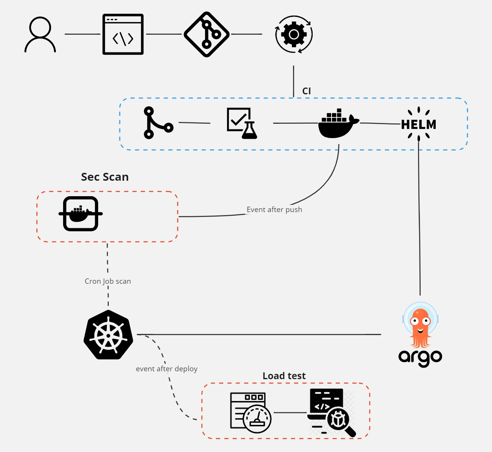

# Improvements

In order to enhance the project in a more professional manner, I propose the following improvements:

1. **Separate Application and Helm Chart Deployment:**
    - This separation enables better versioning and facilitates project rollbacks through the versioned Helm charts.

2. **Isolate Configuration/Infrastructure into a Separate Repository:**
    - This enhances maintainability by having a dedicated repository for all configurations and infrastructure.

3. **Adopt a Professional Kubernetes Environment:**
    - Instead of using a containerized solution like Minikube, consider utilizing more robust solutions such as Amazon EKS or configuring a proper server with an official Kubernetes image.

4. **Dedicated Node for Observability:**
    - Allocate a dedicated node exclusively for observability tools to prevent overloading other nodes.

5. **Dedicated Node for MySQL:**
    - Assign a specific node exclusively for MySQL to avoid overloading other nodes.
        1. Implement a replica database for failover scenarios.
        2. Consider utilizing a cloud option like AWS RDS for efficient management.

6. **Implement Dynamic CI with Event-Based Validation:**
    - Create a Continuous Integration (CI) system that dynamically responds to events for efficient validation processes.
  
    

By implementing these improvements, the project can achieve a more scalable, maintainable, and professional infrastructure. Each enhancement addresses specific aspects of the current setup, contributing to a more robust and efficient development environment.